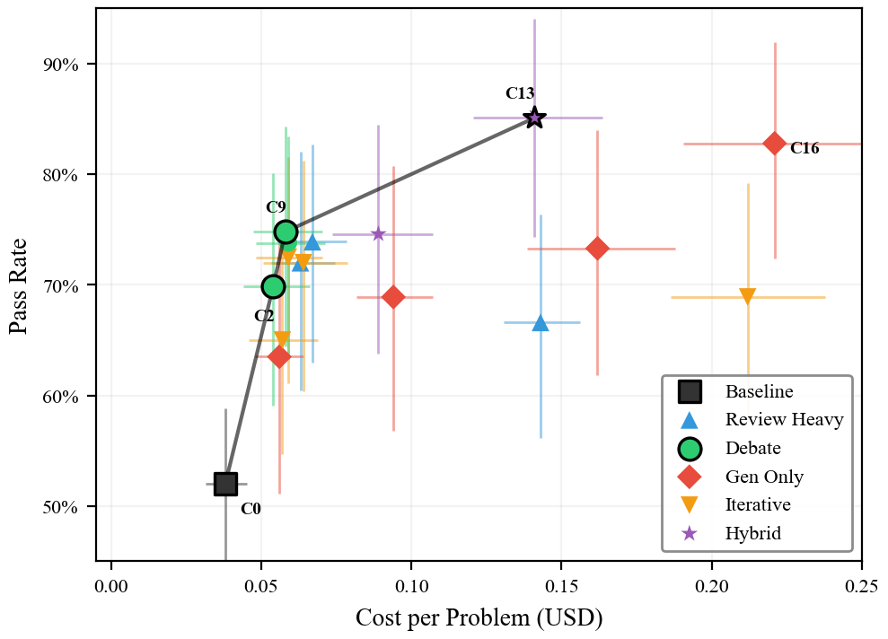
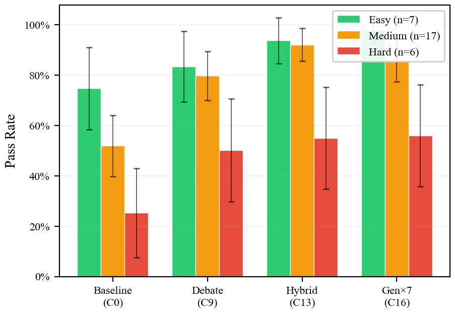
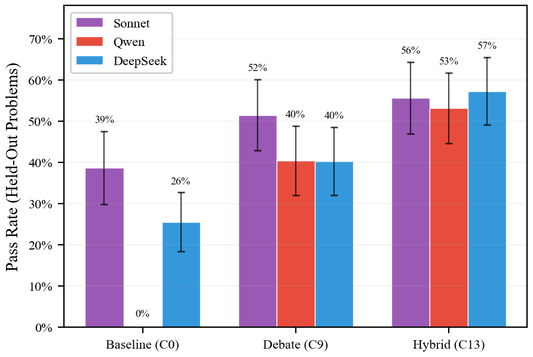
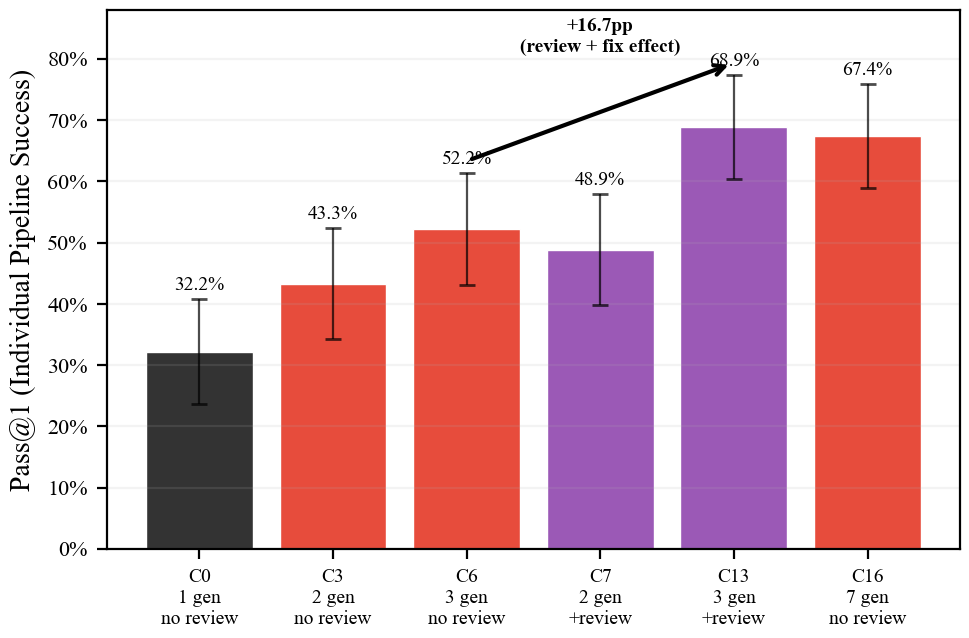
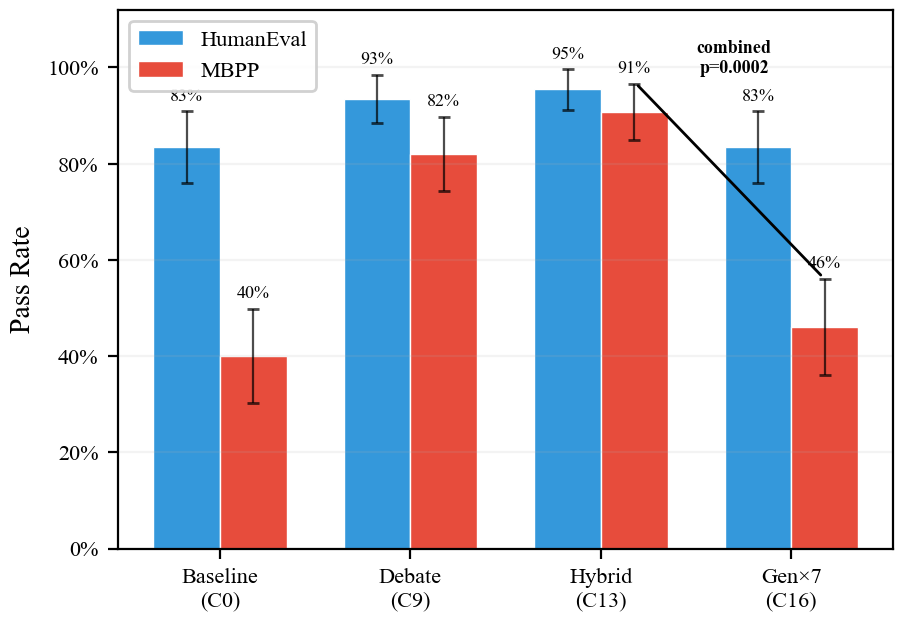
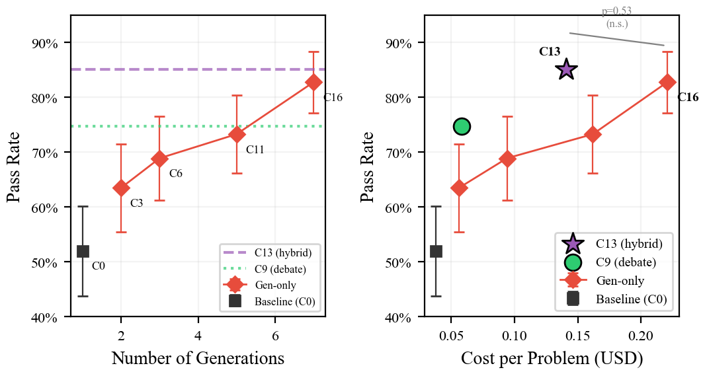
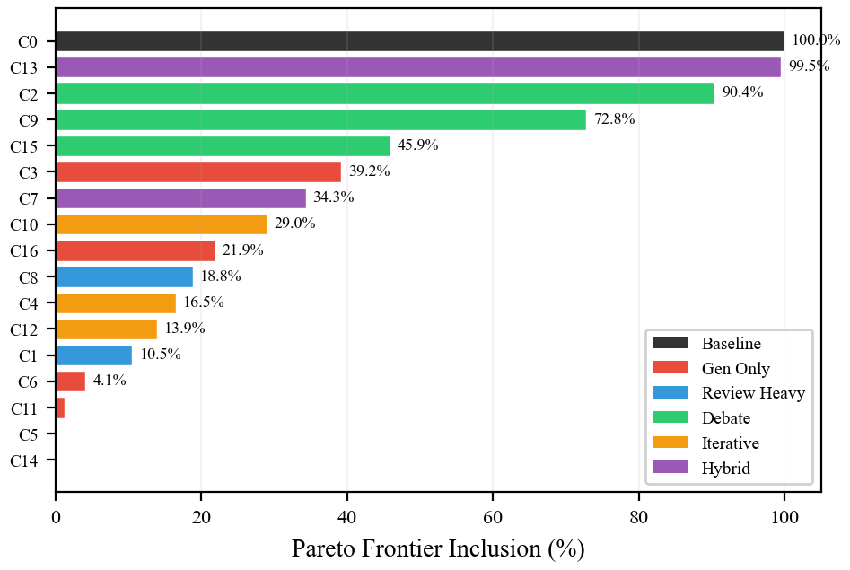

# Structure Beats Scale

**How Structured Review Outperforms Brute-Force Generation in LLM Code Synthesis**

Stevo Ledbetter (Independent Researcher) — March 2026

**[Download Paper (PDF)](https://raw.githubusercontent.com/smledbetter/structure-beats-scale/main/structure-beats-scale.pdf)**  |  [LaTeX Source](structure-beats-scale.tex)

## Abstract

The standard strategy for improving LLM code generation is to generate more samples and pick the best one. Across over 3,000 experimental runs on 60 competitive programming problems, 25 HumanEval problems, and 25 MBPP problems, spanning three code benchmarks, three generator models, and 17 inference-time compute allocation strategies, I find that structured review pipelines — specifically a hybrid of multiple generations with independent reviews on each — generally dominate the Pareto frontier of pass rate versus cost.

On a calibration set of 30 competitive programming problems, the best hybrid configuration (C13: 3 generations + 2 reviews each) achieves **85.1% pass rate at $0.141/problem**, compared to **82.8% at $0.221/problem** for best-of-7 generation (C16). The ordering C0 (baseline) < C9 (debate) < C13 (hybrid) replicates on held-out problems, generalizes across two alternative generators (Qwen 2.5 Coder 32B and DeepSeek V3), and transfers to HumanEval and MBPP (C13=93.0% vs C16=64.7%, p=0.0002).

## Key Results

### Pareto Frontier: Cost vs. Pass Rate



The hybrid pipeline (C13) dominates the cost–quality frontier. Error bars show 95% bootstrap CIs from 10,000 resamples.

### Difficulty Stratification



Review pipelines show the largest gains on medium-difficulty problems. C16 (7 generations, no review) matches C13 on easy and hard problems but falls behind on medium.

### Cross-Model Generalization



The C0 < C9 < C13 ordering holds across Sonnet, Qwen 2.5 Coder 32B, and DeepSeek V3.

### Pass@1: Review Improves Individual Pipelines



Adding review to a 3-generation pipeline (C6→C13) improves pass@1 by 16.7pp — not just a lottery effect.

### Cross-Domain Transfer (HumanEval + MBPP)



On HumanEval and MBPP, C13 achieves 93.0% combined vs. C16's 64.7% (p=0.0002). The MBPP gap drives the difference.

### Generation-Only Scaling



Brute-force generation scales sublinearly. C13 (hybrid) matches 7-generation cost at higher quality. The C13 vs C16 difference is not statistically significant on calibration data (p=0.53) but is significant cross-domain.

### Bootstrap Stability



C0 (baseline) and C13 (hybrid) appear on the Pareto frontier in 100% and 99.5% of bootstrap resamples, respectively.

## Repository Structure

```
.
├── structure-beats-scale.pdf     # Compiled paper
├── structure-beats-scale.tex     # LaTeX source
├── references.bib                # BibTeX references
├── arxiv.sty                     # arXiv-style template
├── figures/                      # Publication figures (PDF + PNG)
├── generate_figures.py           # Script to regenerate figures
├── data/
│   ├── raw/                      # 3,438 JSON result files
│   ├── problems/                 # 62 task definitions (JSON)
│   └── analysis/                 # Aggregated analysis outputs
├── analysis/
│   └── phase0_analysis.py        # Main analysis script
└── CITATION.cff                  # Machine-readable citation
```

## Data Schema

Each file in `data/raw/` is a JSON object with this structure:

```json
{
  "study": "A",
  "condition": "A0",
  "task_id": "cc_000",
  "replica": 0,
  "generation": {
    "model": "claude-sonnet-4-6",
    "code": "...",
    "input_tokens": 758,
    "output_tokens": 1136,
    "cost_usd": 0.019,
    "latency_ms": 18967
  },
  "reviews": [ ... ],
  "aggregated_bugs": [ ... ],
  "fix": { ... },
  "test_results": {
    "total": 50,
    "passed": 50,
    "failed": 0,
    "pass_rate": 1.0,
    "pass_at_1": true,
    "details": [ ... ]
  }
}
```

**File naming:** `{study}_{condition}_{task_id}_{replica}.json`

- **Studies A/B/C:** Calibration set (30 competitive programming problems, 17 conditions)
- **Study D:** Held-out replication (Phases 2-3)
- **Study E:** Cross-model validation (Phases 4, 4b)
- **Study F:** Fixer ablation (Phase 6)
- **generation_*:** Cross-domain (Phase 5) and matched-fixer (Phase 7)

## Reproduction

### Regenerate figures from data

```bash
pip install -r requirements.txt
python generate_figures.py
```

### Run full analysis pipeline

```bash
cd analysis
python phase0_analysis.py
```

Produces 15 output files in `data/analysis/` (CSVs and JSONs with pass rates, bootstrap statistics, cross-model comparisons, etc.)

### Compile paper

Requires a LaTeX distribution (TeX Live or BasicTeX).

```bash
pdflatex structure-beats-scale.tex
bibtex structure-beats-scale
pdflatex structure-beats-scale.tex
pdflatex structure-beats-scale.tex
```

## License

- **Code** (analysis scripts, figure generation): MIT License
- **Data** (experimental results, task definitions): CC-BY-4.0
- **Paper** (LaTeX source, compiled PDF): CC-BY-4.0
